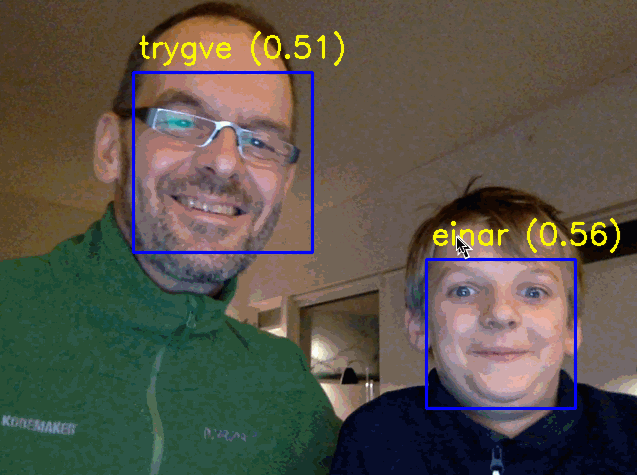

# Face recognition using dlib

## Credits 
This code started out as as a cut and paste from the following sources:

- http://dlib.net/face_recognition.py.html
- https://github.com/ageitgey/face_recognition/blob/master/face_recognition/api.py
- https://medium.com/towards-data-science/facial-recognition-using-deep-learning-a74e9059a150

# Installation

* Install dlib: https://www.pyimagesearch.com/2017/03/27/how-to-install-dlib
* Download dlib models:  http://dlib.net/files
* Download opencv classifiers:  https://github.com/opencv/opencv/blob/master/data/haarcascades

# Run
* Get hold of some images of people you want to recognize. One file per person will do. Name the file after the person. 
* Configure faces_folder_path in source. Run with python3.

# Sample

# Experiments
See folder experiments. In chronological order:
* _raw: first attempt
* _dual: uses both opencv and dlib face-detection
* _faster: A relatively fast implementation using opencv for face detection (and dlib for face recognition)
* _refactor: Last attempt to tidy up
 
